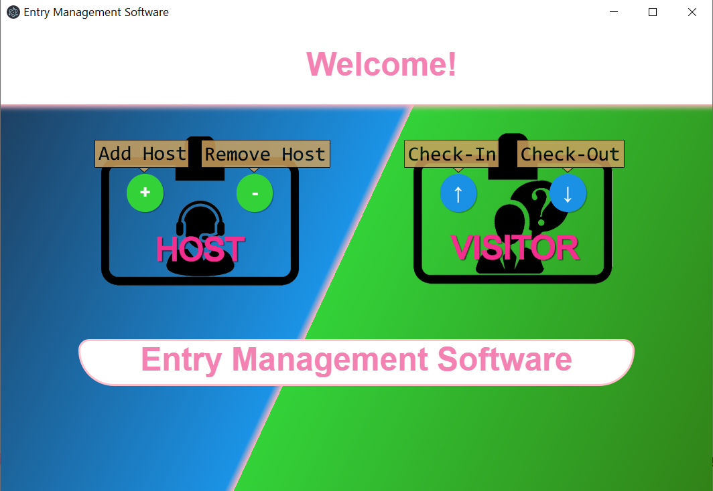
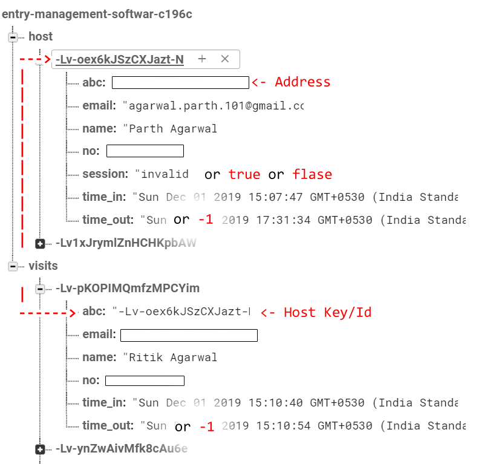
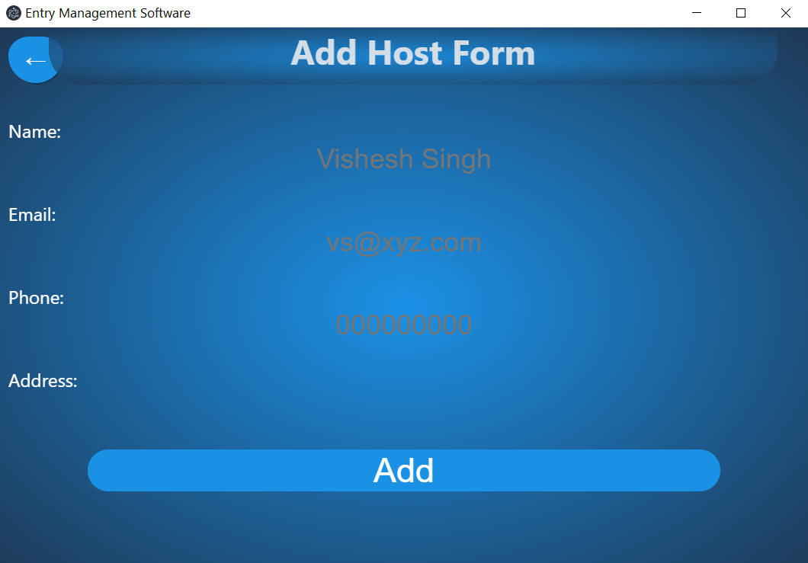
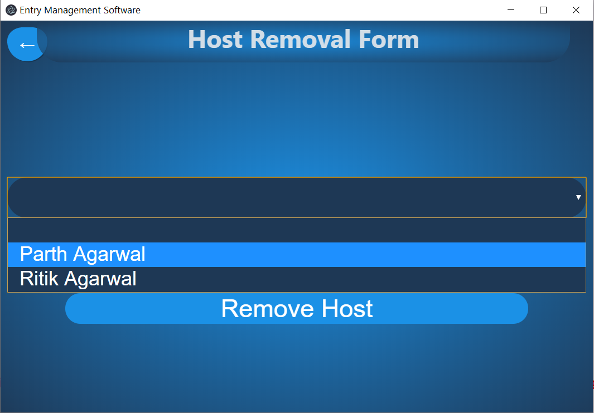
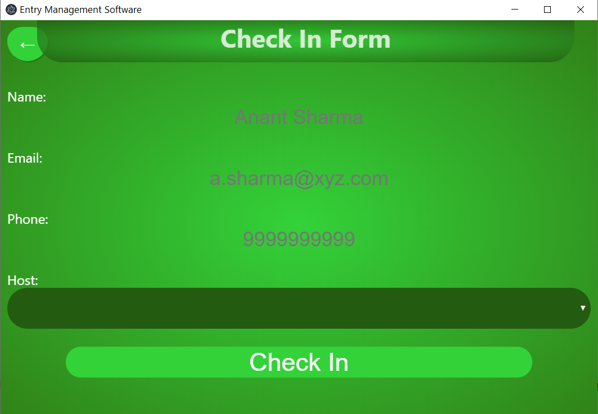
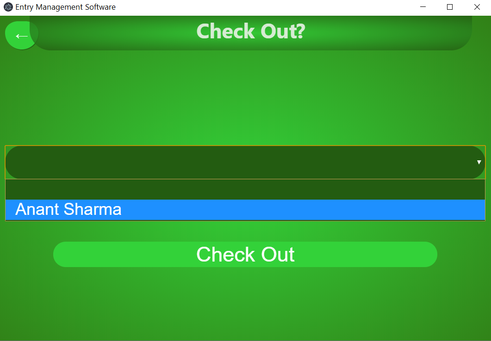

<p align="center">
  
</p>


 [](https://github.com/ra101/Entry-Management-Software/issues) [](https://github.com/ra101/Entry-Management-Software/network/members) [](https://github.com/ra101/Entry-Management-Software/stargazers)    [](https://telegram.me/ra_101)


# :desktop_computer: Download

[](https://github.com/ra101/Entry-Management-Software/releases)

To make the above installation working Goto [dotenv](#dotenv)


## :card_index_dividers: Index

- [Download](#desktop_computer-download)
- [About](#briefcase-about)
  - [Database](#ledger-database)
  - [Workflow](#chart_with_upwards_trend-workflow)
- [Development](#gear-development)
  - [Installation](#floppy_disk-installation)
  - [Build](#package-build)
- [File Structure](#open_file_folder-file-structure)
- [Credit/Acknowledgment](#star2-creditacknowledgment)
- [License](#scroll-license)

## :briefcase: About

It is an <b>Entry Management <i>Cross-Platform</i> Software</b> built using Electron (a Node.js framework)  and Firebase (for database), This app includes Email (Nodemailer Module) and SMS (Nexmo API) automation.


### :ledger: Database

There are 2 collections: Host and Visits, which have entries as given below...

<p align="center">
  
</p>


### :chart_with_upwards_trend: Workflow

There are 2 categories <b>Host</b> and <b>Visitor</b> and 2 Constraint that Each Host can be visited by only one visitor and host can cannot leave until visitor leaves.

Host collection in database has an entry called **"Session"** which can take either *true, false* or *"invalid"*

So, initially there are 4 button:

- Add Host <i>(always active)</i>
- Remove Host <i>(active iff any of host.session is found 'false')</i>
- Check-In *(active iff any of host.session is found 'false')*
- Check-Out *(active iff any of host.session is found 'true')*


#### :heavy_plus_sign: Add Host

<p align='center'>
    	
</p>


A form that stores Name,Email, Phone No and Address(abc) given by host ontu firebase, along with these entries, Time-in, time-out and session are also added where, time-in is timestamp of form submition, time-out is default to -1 and session is set to false.


#### :heavy_minus_sign: Remove Host 

<p align='center'>
    	
</p>


Select the host to be removed, and click the button, all this button does is add update time-out of host to current timestamp and set session to "invalid". (that means host no longer available).

This makes Data remain in database and yet not included in visiting process


#### :arrow_up:	Check-In

<p align='center'>
    	
</p>


Dropdown box appends all hosts with `session===false`.

A form that stores Name,Email, Phone No and Host ID(abc) given by visitor ontu firebase, along with these entries, Time-in and time-out are also added where, time-in is timestamp of form submition and time-out is default to -1.

It also update the Host(ID).session to 'true'. (making host accupied)

After this Email and a SMS is sent to Host using selected ID, stating the details of visitor.


#### :arrow_down:	Check-Out

<p align='center'>
    	
</p>


Dropdown box appends all visitors with `time-out===-1`.

Select the visitor to check out, and click the button, all this button does is update time-out of visitor to current timestamp and set session of host id it is associated with, to false. (that means host is no longer accupied).

After this Email and a SMS is sent to Visitor, stating the details of zer visit.


## :gear: Development

### :floppy_disk: Installation


If you just want to do a simple test run of the application, you can  first

- Clone the repository

```bash
$ git clone https://github.com/ra101/Entry-Management-Software.git
```

- Install dependencies by using the following commands.

```bash
$ cd Entry-Management-Software
$ sudo npm install
```

- Obtain API Key & API Secret from [Nexmo](https://www.nexmo.com/)

- Create an app in Firebase and obtain its Credentials from [Firebase](https://firebase.google.com/)

  
##### dotenv
- Create a `.env` file in root directory and assign the following environment variables
  `NOTE: don't version control your .env file, make sure .env is added in .gitignore file`

```bash
$ touch .env #assuming you are in root directory of app
$ echo "EMAIL=<Your/Admin's Email Id>" >> .env
$ echo "PASS=<Your/Admin's Email Password>" >> .env
$ echo "FBKEY=<Firebase Key>" >> .env
$ echo "AUTHDOMAIN=<Firebase Authdomain>" >> .env
$ echo "DATABASEURL=<Firebase databaseURL>" >> .env
$ echo "PROJECTID=<Firebase ProjectID>" >> .env
$ echo "STORAGEBUCKET=<Firebase Storage Bucket>" >> .env
$ echo "MESSAGINGSENDERID=<Firebase Messaging SenderID>" >> .env
$ echo "APPID=<Firebase AppID>" >> .env
$ echo "NXKEY=<Nexmo API key>" >> .env
$ echo "NXSECRET=<Nexmo API Secret>" >> .env

```


- Firestore uses gRPC. This works in all types of Electron envs but you may see this error at first: “**Failed to load gRPC binary module because it was not installed for the current system”** . there is devDependencies to resolve that i.e. electron-rebuild, more on that in this [Article](https://medium.com/firebase-developers/using-firebase-in-electron-tips-and-tricks-24ac5b44bf5a).

```bash
$ npm install --save-dev electron-rebuild
```

Then, whenever you install a new npm package, rerun electron-rebuild:
```bash
$ npm run rebuild
```

- Finally run the application using 

```bash
$ node start
```


### :package: Build

Install electron-builder as  devDep and run dist:
```bash
$ npm install --save-dev electron-builder
$ npm run dist
```

This will Create a "dist" named folder containing unpacked (folder with multiple files) and Installer (executable). These will show an error, as there is no .env file. To resolve this add .env in installed folder (in case of Installer) or .env directly to uppacked folder


## :open_file_folder: File Structure

- Add a file structure here with the basic details about files, below is an example.

```bash
.Entry-Management-Software
├── .gitignore
├── add.html
├── app.html
|
├───images
│   ├── host.png
│   └── visitor.png
|
├── in.html
├── index.js
├── LICENSE
├── min.html
├── out.html
├── package-lock.json
├── package.json
├── README.md
│
├───scripts
│   ├── app.js
│   ├── display.js
│   ├── form.js
│   └── messaging.js
│
└───stylesheet
    ├── app.css
    └── form.css

3 directories, 19 files
```


## :star2: Credit/Acknowledgment

[](https://github.com/ra101/Entry-Management-Software/graphs/contributors)

## :scroll: License

[](https://github.com/ra101/Entry-Management-Software/blob/master/LICENSE)
